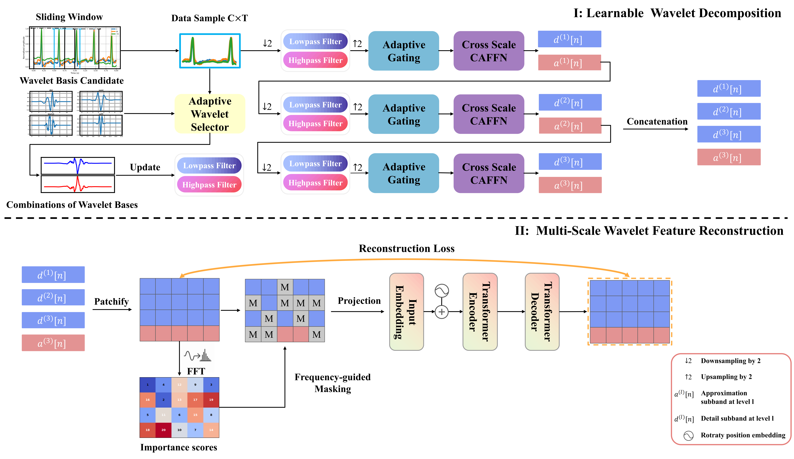

# PhysioWave: A Multi-Scale Wavelet-Transformer for Physiological Signal Representation

[](https://neurips.cc/)
[](https://arxiv.org/abs/2506.10351)
[](https://www.python.org/downloads/)
[](https://pytorch.org/)
[](https://www.google.com/search?q=LICENSE)

Official PyTorch implementation of **PhysioWave**, accepted at **NeurIPS 2025**. PhysioWave is a novel wavelet-based architecture for physiological signal processing that leverages adaptive multi-scale decomposition and frequency-guided masking to advance self-supervised learning.

-----

## 🌟 Key Features

✨ **Learnable Wavelet Decomposition**: Adaptive multi-resolution analysis with soft gating mechanism

📊 **Frequency-Guided Masking**: Novel masking strategy that prioritizes high-energy frequency components

🔗 **Cross-Scale Feature Fusion**: Attention-based fusion across different wavelet decomposition levels

🧠 **Multi-Modal Support**: Unified framework for ECG and EMG signals

📈 **Large-Scale Pretraining**: Models trained on 182GB of ECG and 823GB of EMG data

-----

## 🏗️ Model Architecture

\<div align="center"\>
\
\</div\>

**Model Overview**: The PhysioWave pretraining pipeline begins by initializing a set of standard wavelet functions (e.g., 'db6', 'sym4'), from which learnable low-pass and high-pass filters are generated. These filters are then used for wavelet decomposition to obtain multi-scale frequency-band representations. The decomposed features are processed into spatio-temporal patches, with importance scores computed using FFT-based spectral energy. High-scoring patches are masked and passed through Transformer layers, followed by a lightweight decoder for patch reconstruction.

**Key Components:**

  - 🌊 **Learnable Wavelet Decomposition** - Adaptively selects optimal wavelet bases for input signals
  - 📐 **Multi-Scale Feature Reconstruction** - Hierarchical decomposition with soft gating between scales
  - 🎯 **Frequency-Guided Masking** - Identifies and masks high-energy patches for self-supervised learning
  - 🔄 **Transformer Encoder/Decoder** - Processes masked patches with rotary position embeddings

-----

## 📊 Performance Highlights

| Task | Dataset | Performance |
|------|---------|-------------|
| **ECG Arrhythmia Classification** | PTB-XL | **73.1%** Accuracy |
| **ECG Multi-Label Classification** | CPSC 2018 | **77.1%** F1-Micro |
| **ECG Multi-Label Classification** | Shaoxing | **94.6%** F1-Micro |
| **EMG Gesture Recognition** | EPN-612 | **94.5%** Accuracy |

**Multi-Label Classification Detailed Metrics:**

  * **CPSC 2018 (9-Class):**

      * Precision(micro/macro): 0.7389 / 0.6173
      * Recall(micro/macro): 0.8059 / 0.6883
      * F1(micro/macro): 0.7709 / 0.6500
      * AUROC(micro/macro): 0.9584 / 0.9280

  * **Shaoxing (4-Class):**

      * Precision(micro/macro): 0.9389 / 0.9361
      * Recall(micro/macro): 0.9536 / 0.9470
      * F1(micro/macro): 0.9462 / 0.9413
      * AUROC(micro/macro): 0.9949 / 0.9930

-----

## 💾 Pretrained Models

\<div align="center"\>

### [📥 Download Pretrained Models](https://drive.google.com/drive/folders/1CobMgFT1WIOAHfz1j7Yij3BL6kkjm59k?dmr=1&ec=wgc-drive-globalnav-goto)

| Model | Parameters | Description |
|-------|------------|-------------|
| `ecg.pth` | 14M | ECG pretrained model |
| `emg.pth` | 5M | EMG pretrained model |

\</div\>

-----

## 🚀 Quick Start

### Prerequisites

```bash
# Clone repository
git clone https://github.com/ForeverBlue816/PhysioWave.git
cd PhysioWave

# Create conda environment
conda create -n physiowave python=3.11
conda activate physiowave

# Install PyTorch (CUDA 12.1)
pip install torch torchvision torchaudio --index-url https://download.pytorch.org/whl/cu121

# Install requirements
pip install -r requirements.txt
```

### 📦 Data Preparation

\<details\>
\<summary\>\<b\>Dataset Download Links\</b\>\</summary\>

**ECG Datasets:**

  - [PTB-XL Database](https://physionet.org/content/ptb-xl/1.0.3/)
  - [MIMIC-IV-ECG](https://physionet.org/content/mimic-iv-ecg/1.0/)
  - [PhysioNet Challenge 2021](https://physionet.org/content/challenge-2021/1.0.3/)
  - [CPSC 2018](https://www.google.com/search?q=https://www.kaggle.com/datasets/api/competitions/cpsc-2018)
  - [Chapman-Shaoxing](https://www.google.com/search?q=https://www.kaggle.com/datasets/yuty2022/chapmanshaoxing-ecg)

**EMG Datasets:**

  - [EPN-612 Dataset](https://zenodo.org/records/4421500)
  - [NinaPro Database](https://ninapro.hevs.ch/instructions/DB6.html)

\</details\>

\<details\>
\<summary\>\<b\>Data Format Specifications\</b\>\</summary\>

**HDF5 Structure:**

```python
{
    'data': (N, C, T),  # Signal data: float32
    'label': (N,)       # Labels: int64 (for single-label)
    # 'label': (N, K)   # Labels: float32/int (for multi-label)
}
```

Where: `N` = samples, `C` = channels, `T` = time points

**Signal Specifications:**

| Signal | Channels | Length | Sampling Rate | Normalization |
|--------|----------|--------|---------------|---------------|
| ECG | 12 | 2048 | 500 Hz | MinMax [-1,1] or Z-score |
| EMG | 8 | 1024 | 200-2000 Hz | Max-abs or Z-score |

\</details\>

### 🔄 Preprocessing Examples

\<details\>
\<summary\>\<b\>ECG Preprocessing (PTB-XL - Single-Label)\</b\>\</summary\>

```bash
# Download and preprocess PTB-XL
wget -r -N -c -np https://physionet.org/files/ptb-xl/1.0.3/
python ECG/ptbxl_finetune.py
```

Output: `train.h5`, `val.h5`, `test.h5` with shape `(N, 12, 2048)` and label shape `(N,)`.

\</details\>

\<details\>
\<summary\>\<b\>ECG Preprocessing (CPSC / Shaoxing - Multi-Label)\</b\>\</summary\>

```bash
# Download CPSC 2018 dataset and preprocess
python ECG/cpsc_multillabel.py

# Download Chapman-Shaoxing dataset and preprocess
python ECG/shaoxing_multilabel.py
```

Output: `train.h5`, `val.h5`, `test.h5` with label shape `(N, num_classes)`.

\</details\>

\<details\>
\<summary\>\<b\>EMG Preprocessing (EPN-612)\</b\>\</summary\>

```bash
# Download from Zenodo and preprocess
python EMG/epn_finetune.py
```

Output: `epn612_train_set.h5`, `epn612_val_set.h5`, `epn612_test_set.h5` with shape `(N, 8, 1024)`.

\</details\>

### 🎯 Training

#### Pretraining

```bash
# ECG Pretraining
bash ECG/pretrain_ecg.sh

# EMG Pretraining  
bash EMG/pretrain_emg.sh
```

#### Fine-tuning

**Single-Label Classification**

```bash
# Standard Fine-tuning
bash ECG/finetune_ecg.sh  # For ECG
bash EMG/finetune_emg.sh  # For EMG
```

**Multi-Label Classification**
This repository uses `finetune_multilabel.py` for multi-label classification tasks, such as those on the CPSC or Shaoxing datasets. First, prepare your data using the corresponding preprocessing scripts (e.g., `ECG/cpsc_multilabel.py`, `ECG/shaoxing_multilabel.py`).

Then, run the multi-label fine-tuning script. An example configuration (similar to `ECG/shaoxing_multilabel.sh`) is provided below:

```bash
# Launch distributed fine-tuning for multi-label ECG
NUM_GPUS=4
torchrun --nproc_per_node=${NUM_GPUS} finetune_multilabel.py \
  --train_file "path/to/shaoxing/train.h5" \
  --val_file "path/to/shaoxing/val.h5" \
  --test_file "path/to/shaoxing/test.h5" \
  --pretrained_path "path/to/pretrained_ecg/best_model.pth" \
  \
  `# Task Configuration` \
  --task_type multilabel \
  --threshold 0.3 \
  \
  `# ECG Model Architecture (must match pretrained model)` \
  --in_channels 12 \
  --max_level 3 \
  --wave_kernel_size 24 \
  --wavelet_names db4 db6 sym4 coif2 \
  --use_separate_channel \
  --patch_size 64 \
  --embed_dim 384 \
  --depth 8 \
  --num_heads 12 \
  \
  `# Fine-tuning Parameters` \
  --batch_size 16 \
  --epochs 10 \
  --lr 1e-4 \
  --scheduler cosine \
  --warmup_epochs 5 \
  \
  `# Other Settings` \
  --seed 42 \
  --output_dir "./finetune_ecg_multilabel_output"
```

**Zero-Shot Evaluation (Linear Probing)**

```bash
# Zero-Shot Evaluation (Linear Probing)
torchrun --nproc_per_node=4 finetune.py \
  --pretrained_path ./pretrained/ecg.pth \
  --freeze_encoder \  # Freezes encoder for linear probing
  --num_classes 5 \
  --epochs 10
```

-----

## 🔧 Key Parameters

\<details\>
\<summary\>\<b\>Model Configuration\</b\>\</summary\>

| Parameter | Description | Options |
|-----------|-------------|---------|
| `--in_channels` | Input channels | 12 (ECG), 8 (EMG) |
| `--max_level` | Wavelet decomposition levels | 3 (default) |
| `--wavelet_names` | Wavelet families | `db4 db6 sym4 coif2` |
| `--embed_dim` | Embedding dimension | 256/384/512 |
| `--depth` | Transformer layers | 6/8/12 |

**💡 Wavelet Selection Tips:**

  - ECG: `db4 db6 sym4 coif2` - Optimal for QRS complexes
  - EMG: `sym4 sym5 db6 coif3 bior4.4` - Best for muscle patterns
  - Custom: Experiment with different combinations for your data\!

\</details\>

\<details\>
\<summary\>\<b\>Training Configuration\</b\>\</summary\>

| Parameter | Description | Default |
|-----------|-------------|---------|
| `--mask_ratio` | Masking ratio | 0.7 (ECG), 0.6 (EMG) |
| `--masking_strategy` | Masking type | `frequency_guided` |
| `--freeze_encoder` | Zero-shot mode | False |
| `--label_smoothing` | Label smoothing | 0.1 |
| `--task_type` | Fine-tuning task type | `multilabel` or `classification` |
| `--threshold` | Prediction threshold for multi-label | 0.3 or 0.5 |

\</details\>

-----

## 📖 Citation

If you find our work helpful, please cite:

```bibtex
@article{chen2025physiowave,
  title={PhysioWave: A Multi-Scale Wavelet-Transformer for Physiological Signal Representation},
  author={Chen, Yanlong and Orlandi, Mattia and Rapa, Pierangelo Maria and Benatti, Simone and Benini, Luca and Li, Yawei},
  journal={arXiv preprint arXiv:2506.10351},
  year={2025}
}
```

-----

## 🤝 Contact & Contributions

**Lead Author**: Yanlong Chen  
**Email**: [yanlchen@student.ethz.ch](mailto:yanlchen@student.ethz.ch)

We welcome contributions\! Feel free to:

  - 🐛 Report bugs via [Issues](https://github.com/ForeverBlue816/PhysioWave/issues)
  - 💡 Suggest enhancements
  - 🔧 Submit Pull Requests

-----

## 🙏 Acknowledgments

We thank the authors of the datasets used in this work and the PyTorch team for their excellent framework.

-----

\<div align="center"\>
\<sub\>Built with ❤️ for the physiological signal processing community\</sub\>
\</div\>
